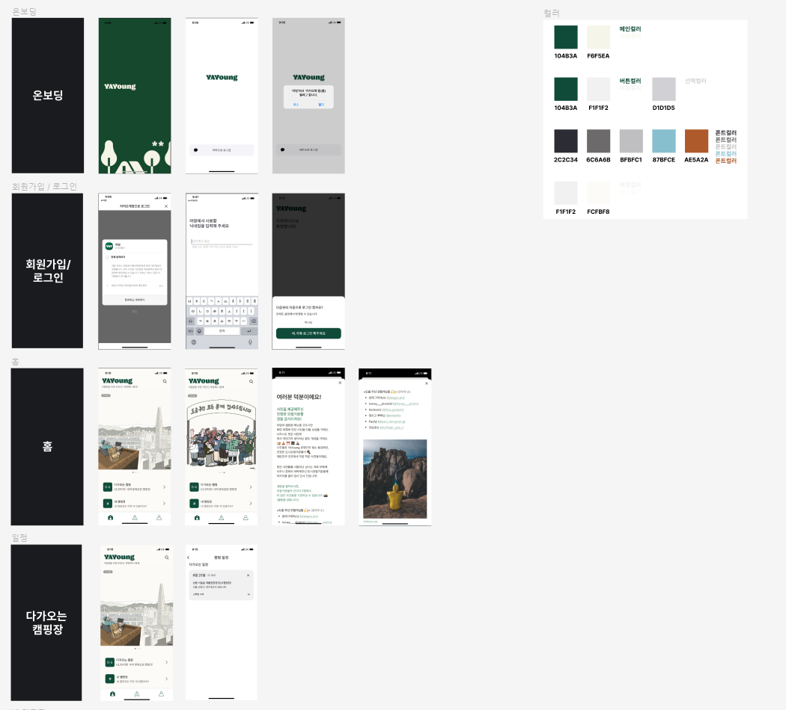
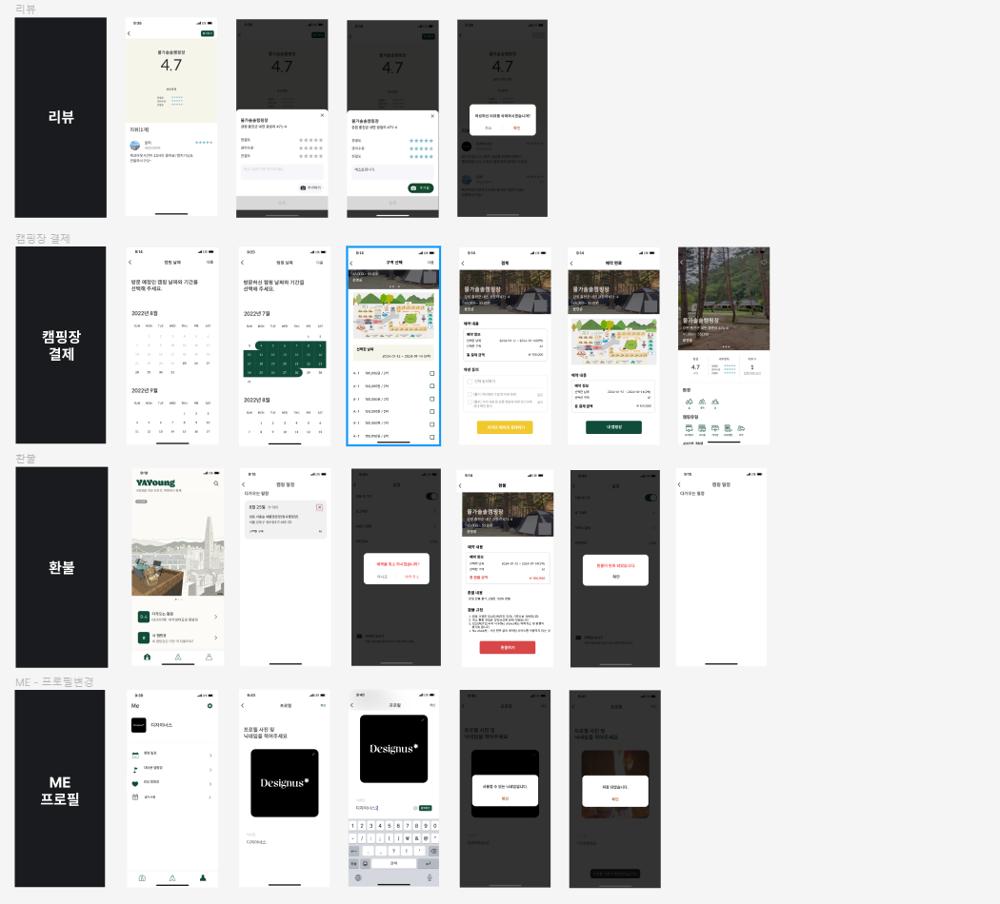
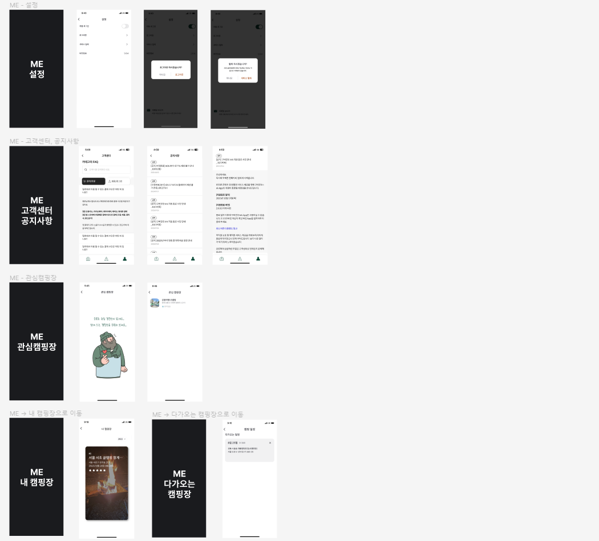

# YAYoung 팀 프로젝트

## 목차
- [프로젝트 소개](#프로젝트-소개)
- [시연영상](#시연-영상)
- [기술스택](#기술스택)
- [화면구성](#화면구성)
- [ERD](#erd)
- [일정관리](#일정관리)
- [보완할 점](#보완할-점)
- [느낀 점](#느낀-점)

## 프로젝트 소개

### 팀원
- 박세환 (팀장, 플러터) [](https://github.com/bbarkse93)
- 김대욱 (플러터) [](https://github.com/saki8661)
- 김승신 (스프링) [](https://github.com/seunggod)
- 김언약 (플러터) [](https://github.com/yakyakyak12)
- 남은혜 (스프링) [](https://github.com/muaga)
- 전우진 (스프링) [](https://github.com/m40ro)

### 프로젝트 기간
- 2024년 1월 3일 ~ 2024년 1월 19일 (16일 간)

### 어플 설명
YaYoung은 캠핑장의 정보를 한눈에 볼 수 있고 일정을 등록해서 관리할 수 있으며 리뷰를 통해 다른 사람의 평가를 확인 할 수 있는 캠핑장 앱으로써 해당 앱을 클론 코딩 했습니다.

## 시연 영상
[](https://www.youtube.com/watch?v=DnakjiCeETY&t=14s)

https://github.com/bbarkse93/project-yayoung-flutter/assets/135561618/85171b99-c839-4303-a5db-e949a1457619

## 구현 기능

### 유저 관련 기능
- 소셜 로그인 (휴대폰 로컬에 jwt 저장)
- 로그아웃
- 개인정보 수정
- 회원탈퇴
- 공지사항 및 FAQ 조회

### 캠핑장 관련 기능
- 옵션별 캠핑장 목록 보기 (필터링)
- 캠핑장 리뷰 달기 (리뷰)
- 캠핑장 검색 기능 (검색)
- 캠핑장 예약(결제) / 취소(환불)
- 다가 오는 캠핑장 확인 (일정관리)
- 다녀온 캠핑장 확인
- 캠핑장 북마크
- 캠핑장 위치 연결(지도)
- 캠핑장 전화 연결
- 캠핑장 웹사이트 연결

## 기술스택

### Backend
 

 

 


### Frontend
 


 


 


### IDE
 

### 협업도구
     

### 데이터베이스
 

### 라이브러리
```dart
cupertino_icons: ^1.0.6
kakao_flutter_sdk: ^1.8.0
kakao_flutter_sdk_friend: ^1.8.0
flutter_naver_login: ^1.8.0
flutter_svg: ^2.0.9
flutter_lints: ^2.0.3
validators: ^3.0.0
font_awesome_flutter: ^10.6.0
intl: ^0.18.1
dio: ^5.4.0
flutter_riverpod: ^2.4.9  
provider: ^6.1.1
logger: ^2.0.2+1
flutter_secure_storage: ^9.0.0
animated_splash_screen: ^1.3.0
image_picker: ^1.0.7
carousel_slider: ^4.2.1
table_calendar: ^3.0.9
url_launcher: ^6.0.6
file_picker: ^6.1.1
google_maps_flutter: ^2.5.3
geocoding: ^2.1.1
iamport_flutter: ^0.10.0
webview_flutter: ^4.4.4
tuple: ^2.0.2
flutter_localization: ^0.2.0
geolocator: ^10.1.0
```

## 화면구성
[](https://www.figma.com/file/Ptkc7WCoBYO1di2kKHL7Z4/YAYoung?type=design&mode=design&t=Pxxgh3MPpkGZiqRn-0)





## ERD
[](https://dbdiagram.io/d/yayoung-6595042bac844320ae252152)


## 일정관리
[](https://paper-danthus-c42.notion.site/1-d1049a409e494da0a0cb1475f7978c13?pvs=4)


## 보완할 점

- 오늘 이전 날짜 선택 못하게 막기 
- 예약 가득 찬 날짜 선택 못하게 막기 
- 개인정보 수정 오류 수정하기 
- 자동로그인, 회원탈퇴, 로그아웃 
- 이미지 보관 용량 줄이는 방법 알아보기 
- 베포

## 느낀 점
- 아키택처는 MVVM 패턴을 사용하여 Model - View - ViewModel 각각의 역할을 분리하여 앱을 제작하였습니다. 장점은 ViewModel에서는 View에서 일어나는 변화를 담당 하는대 
  각각의 View가 ViewModel을 가지게 되면서 코드의 가독성이 좋아졌고 유지 관리가 수월해져서 더 편하게 작업할 수 있었습니다. 
- Flutter에서 Riverpod을 사용하여 상태관리를 하였습니다. 프로바이더를 통해 전역적으로 상태에 접근할 수 있었고, ref.watch를 통해 상태가 변경되는 것을 감지하고 
  변경되는 모습들이 신기했고 재미있었습니다. 
- Flutter를 하면서 컨밴션과 컴포넌트의 중요함을 느꼈습니다. 글자와 텍스트 컬러 등등 각각의 팀원들이 다르게 입력할 수 있기 때문에 _core안 Constants 폴더에 color, move, icon 등
  공통적으로 맞추어줘야할 부분들을 컴퍼넌트화 시켜 관리하고 사용하였습니다. 이렇게 컨벤션을 정해 사용하다보니 다른 작업을 함에도 글자나 컬러 등 일관성 있게 작업할 수 있었고
  size나 컬러 등을 고민할 시간을 줄일 수 있어서 효율적으로 개발할 수 있었던거 같습니다. 
- PortOne이라는 결제 사이트를 이용해 테스트 결제, 환불을 진행하였습니다. 카카오, 네이버 등등 각각의 API 문서가 있지만 API문서를 모아둔 PortOne이라는 결제 사이트를 이용하면서
  API 문서를 읽는 방법을 조금 알 수 있었고 테스트 결제를 통해 결제가 완료됨을 보는 것이 너무 재미있고 신기했었습니다. 생각했던거보다 API 문서를 따라하는게 어려워서 
  API를 보고 개발 할 수 있는 개발자가 되고싶다는 생각을 했습니다. 
